# Nova Browser Agent (AgenticBrowser)

[](https://github.com/manojkumarfade/NOVA)

> **The Advanced AI-Powered Chrome Extension**
> *Verified by Manoj Kumar. Powered by Nova Intelligence.*

---

## 📖 Overview

**Nova** is an **Agentic execution engine** living inside your browser. Not just a chatbot, Nova uses the **Chrome Debugger Protocol (CDP)** to actively drive the browser—clicking, scrolling, typing, and navigating like a human. 

| **Ownership** | **Privacy Model** | **Security** |
| :--- | :--- | :--- |
| **Manoj Kumar** | **Local-First** (Data on your machine) | **AES-256 Encrypted** Keys |

---

## 📽️ Visual Showcase

Explore Nova's capabilities through these powerful features.

| Feature & Description | Visual Experience |
| :--- | :--- |
| **1. Agent Mode (The Brain)**<br>The core recursive reasoning loop. Visualizes the Planner -> Navigator -> Validator cycle and dynamic action execution.<br><br>_Watch how Nova thinks and acts._ | <video src="https://github.com/manojkumarfade/NOVA/raw/main/extension/public/videos/Agent%20Mode.mp4" controls="controls" width="100%"></video><br><br><br> |
| **2. Shopping Agent**<br>Specialized for e-commerce. Performs cross-platform price comparison, spec extraction, and deal analysis.<br><br>_See Nova find the best deals._ | <video src="https://github.com/manojkumarfade/NOVA/raw/main/extension/public/videos/Shopping%20Agent.mp4" controls="controls" width="100%"></video><br><br><br>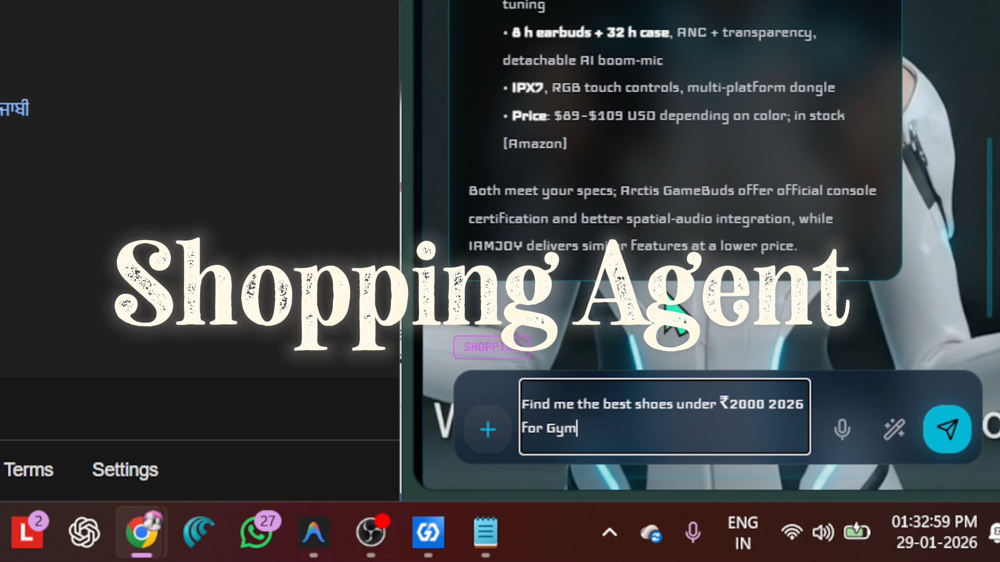 |
| **3. Files Analyzer**<br>Intelligent file reading and analysis. Upload documents and let Nova parse, summarize, and explain them for you.<br><br>_Unlock insights from your files._ | <video src="https://github.com/manojkumarfade/NOVA/raw/main/extension/public/videos/Files%20Analyzer.mp4" controls="controls" width="100%"></video><br><br> |
| **4. Web Search Agent**<br>Autonomous research assistant. Synthesizes fact-based answers from live web data, providing up-to-date information.<br><br>_Research made effortless._ | <video src="https://github.com/manojkumarfade/NOVA/raw/main/extension/public/videos/Web%20Search.mp4" controls="controls" width="100%"></video><br><br>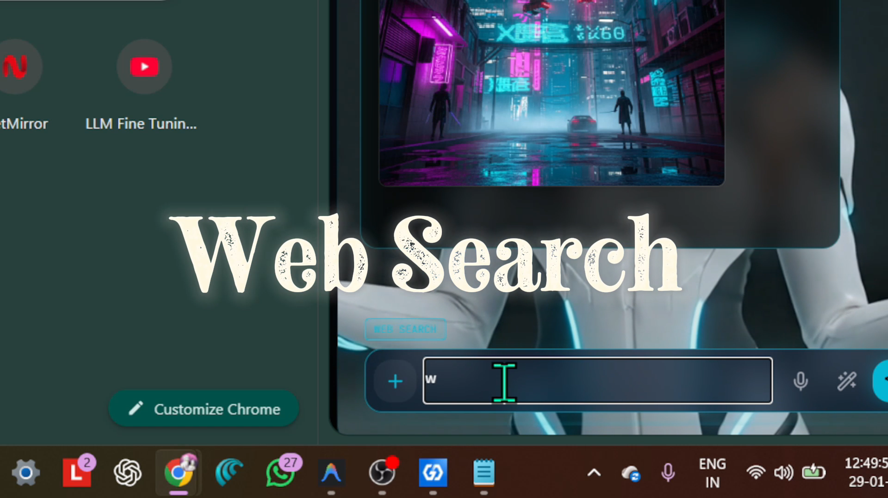<br>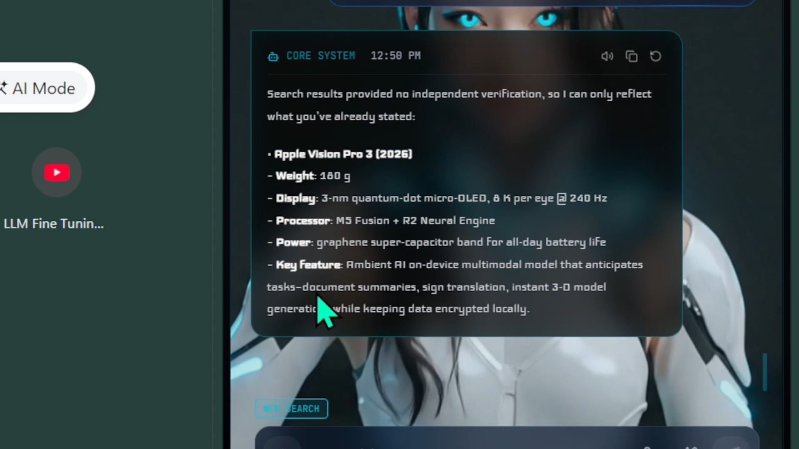 |
| **5. Image Generation**<br>Integrated diffusion models to synthesize assets directly from natural language prompts.<br><br>_Create visuals instantly._ | <video src="https://github.com/manojkumarfade/NOVA/raw/main/extension/public/videos/Image%20Generation.mp4" controls="controls" width="100%"></video><br><br><br>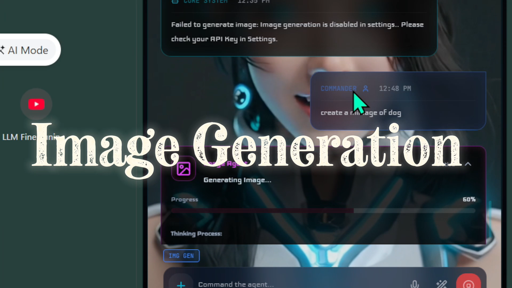 |
| **6. Side Panel Overview**<br>A tour of the intuitive Side Panel interface, giving you quick access to all agents and features at a glance.<br><br>_Your command center._ | <video src="https://github.com/manojkumarfade/NOVA/raw/main/extension/public/videos/Side%20Panel%20Overview.mp4" controls="controls" width="100%"></video><br><br> |
| **7. Text-to-Speech (TTS) & Chat**<br>Advanced voice interaction and history.<br><br>_Listen to Nova speak._ | <video src="https://github.com/manojkumarfade/NOVA/raw/main/extension/public/videos/TTS.mp4" controls="controls" width="100%"></video><br><br>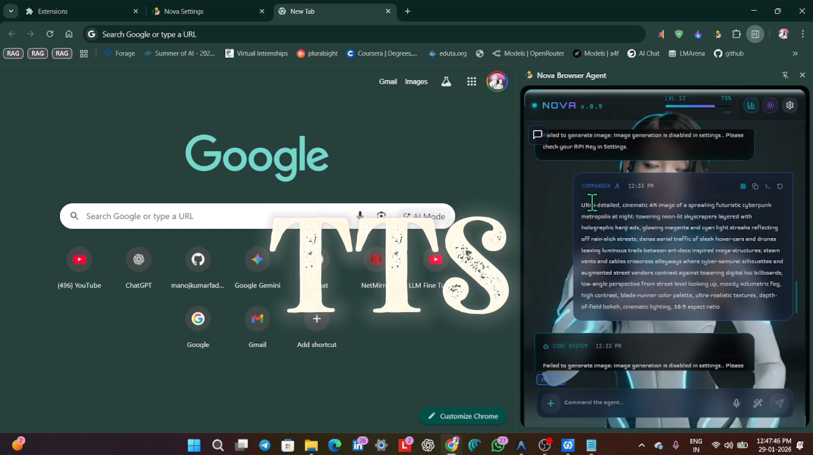<br>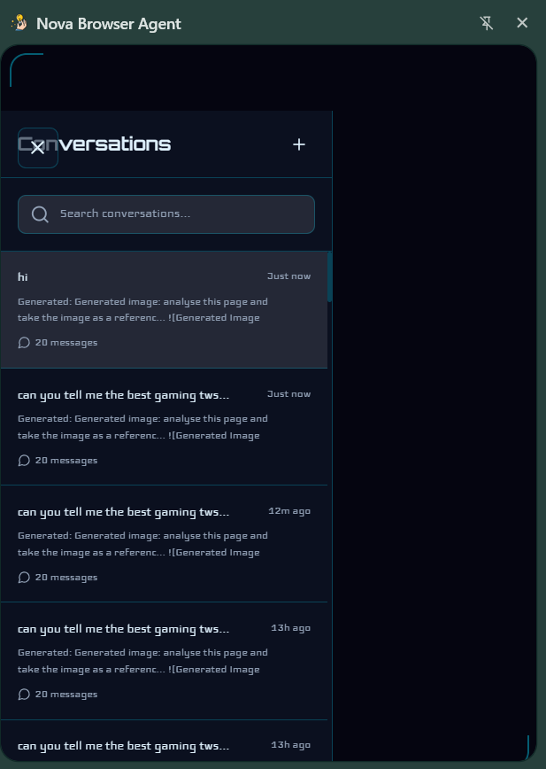 | 
| **8. Tutorial, Settings & Support**<br>Comprehensive settings and support.<br><br>_Customize your experience._ | <video src="https://github.com/manojkumarfade/NOVA/raw/main/extension/public/videos/Tutorial%20&%20Settings.mp4" controls="controls" width="100%"></video><br><br>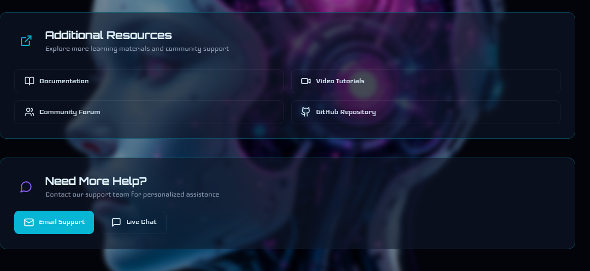<br>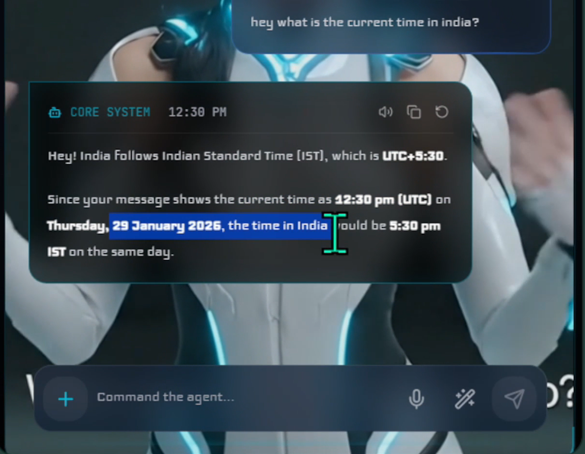 |
| **9. Security & DOM Vision**<br>Includes a Security Firewall to block trackers and a Visual Accessibility Tree to "see" the web structure.<br> | 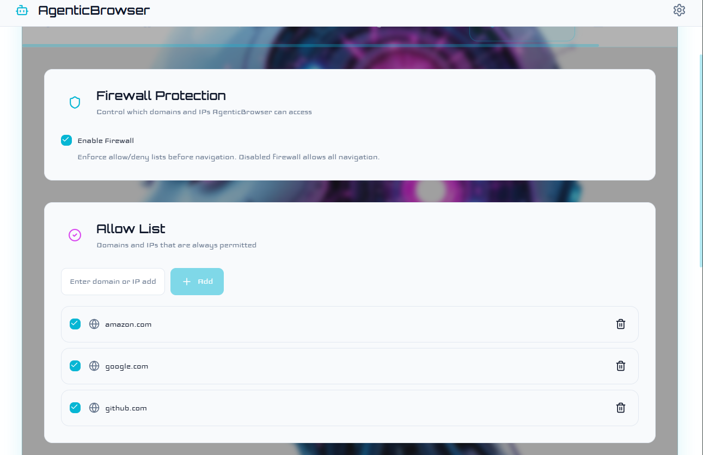<br><br><br> |
| **10. Analytics Dashboard**<br>Track your usage, tokens, and agent performance metrics in real-time.<br> | 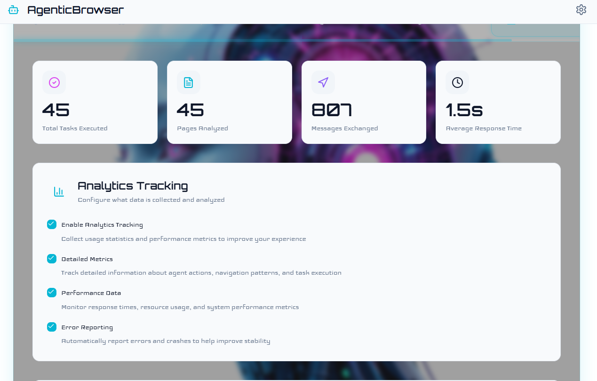<br>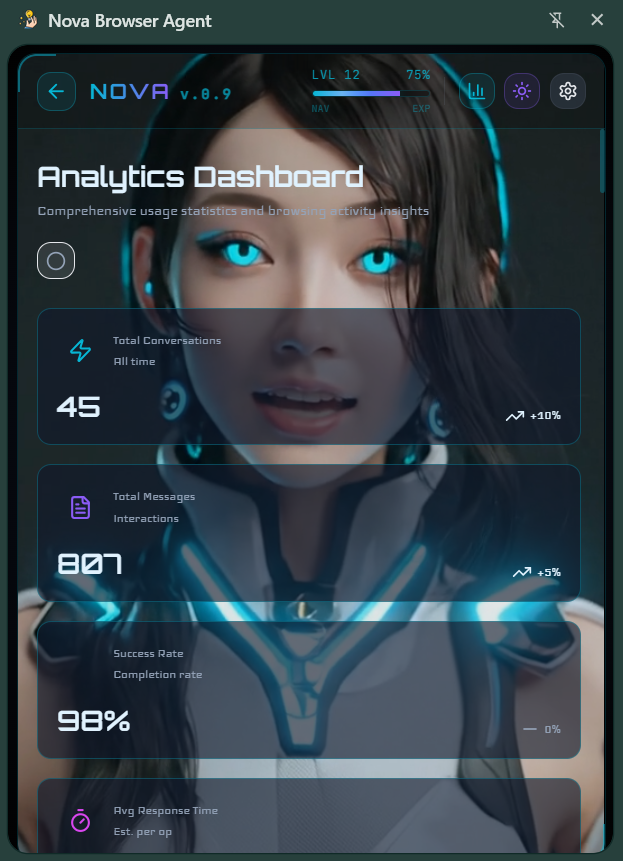 |

---

## 🛠️ Tech Stack using Modern Standards

| Category | Technologies |
| :--- | :--- |
| **Core Framework** | React 18, Vite 5, TailwindCSS |
| **Extension Runtime** | Manifest V3 (Service Worker based) |
| **Browser Protocol** | Chrome Debugger Protocol (CDP) |
| **State Management** | Zustand + Supabase (Auth) |
| **AI Models** | GPT-4o, Claude 3.5 Sonnet, Gemini Flash 1.5 |

---

## 🚀 Quick Start Guide

> **📹 Watch the Installation Guide:**
>
> <video src="https://github.com/manojkumarfade/NOVA/raw/main/extension/public/videos/How%20to%20install%20extension.mp4" controls="controls" width="100%"></video>

**1. Clone the repository**
```bash
git clone https://github.com/manojkumarfade/NOVA.git
cd NOVA
```

**2. Install Dependencies**
```bash
npm install
```

**3. Build the Extension**
```bash
npm run build:extension
# Generates production build in extension/dist
```

**4. Load in Chrome**
1. Open `chrome://extensions`
2. Enable **Developer Mode**
3. Click **Load Unpacked** -> Select `extension/dist`

---

## 🧩 Core Logic (Under the Hood)

<details>
<summary><b>🧠 The Cognitive Loop (The Brain)</b></summary>
<br>
Nova operates on a recursive reasoning cycle: <b>Observe -> Think -> Act -> Verify</b>.

```javascript
// AgentService.js (Simplified)
while (!isFinished && turnCount < maxTurns) {
    // 1. OBSERVE: Get visual state of the browser
    const state = await Observer.getBrowserState(tab.id);
    
    // 2. THINK: Predict next action using LLM
    const prompt = `Goal: ${userRequest} \n State: ${state}`;
    const action = await LLMClient.chatCompletion(prompt);
    
    // 3. ACT: Execute action via CDP
    await hybridCore.executeAction(action, state.interactives);
    
    // 4. VERIFY: Check if the action had the desired effect
    const newState = await Observer.getBrowserState(tab.id);
    if (newState.url === state.url) {
        history.push("System: Action seemed to fail. Retrying...");
    }
}
```
</details>

<details>
<summary><b>👁️ DOM Analysis (The Eyes)</b></summary>
<br>
Nova scans the DOM and assigns unique IDs to interactive elements to create a Visual Accessibility Tree.

```javascript
// Observer.js
function getBrowserState() {
    const interactives = document.querySelectorAll('button, a, input');
    return Array.from(interactives).map((el, index) => ({
        id: index + 1,
        tag: el.tagName,
        rect: el.getBoundingClientRect()
    }));
}
```
</details>

<details>
<summary><b>🤖 Hybrid Execution (The Hands)</b></summary>
<br>
Handles modern apps by falling back to CDP hardware simulation when JS clicks fail.

```javascript
// Navigator.js
async executeStep(action) {
    if (action.action === "CLICK") {
        const jsSuccess = await this.tryJSClick(action.id);
        if (!jsSuccess) {
            // Hardware Mouse Simulation
             await chrome.debugger.sendCommand({ tabId }, "Input.dispatchMouseEvent", { 
                type: "mousePressed", x, y, button: "left" 
            });
        }
    }
}
```
</details>

---

## 📬 Contact & Support

For support, feedback, or collaboration:

| Platform | Link |
| :--- | :--- |
| **LinkedIn** | [](https://www.linkedin.com/in/booramanojkumar/) |
| **Telegram** | [](https://t.me/nova_gent) |

---

Created with ❤️ by **Manoj Kumar** © 2026. All Rights Reserved.
