# Nova Browser Agent (AgenticBrowser)

[](https://github.com/manojkumarfade/NOVA)
[](https://github.com/manojkumarfade/NOVA)

> **The Advanced AI-Powered Chrome Extension**
> *Verified by Manoj Kumar. Powered by Nova Intelligence.*

---

## 📖 Overview

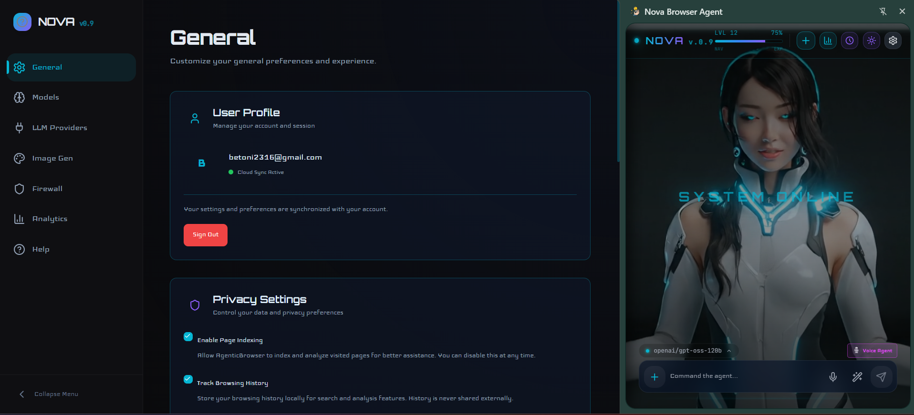

**Nova** is an **Agentic Execution Engine** living inside your browser. Not just a chatbot — Nova uses the **Chrome Debugger Protocol (CDP)** to actively drive the browser — clicking, scrolling, typing, and navigating like a human.

| **Ownership** | **Privacy Model** | **Security** | **Cost** |
| :--- | :--- | :--- | :--- |
| **Manoj Kumar** | **Local-First** (Data on your machine) | **AES-256 Encrypted** Keys | **100% Free & Open Source** |

---

## 🆕 What's New in v2.0

| Feature | Description |
| :--- | :--- |
| 🎙️ **Voice Agent** | Separate Voice Agent button (top bar) + Mic button (chat input) for voice dictation |
| 🎵 **Song Detection** | Identify songs through lyrics (voice search) |
| 🛍️ **Shopping v2** | Compare prices + Add to Cart + View Product + Flash.co comparison |
| 🎨 **Vision Image Gen** | Generate images using current page as visual reference |
| 📁 **File Upload** | Upload & analyze images, PDFs, DOCX, code files with Vision AI |
| 🧠 **Reasoning Box** | See the AI's thinking process in real-time |
| 🔑 **More LLM Providers** | 50+ models: TypeGPT, OpenAI, Anthropic, Gemini, Grok, DeepSeek |
| ✨ **Updated UI** | Premium glassmorphism design with smooth animations |

---

## 📽️ Visual Showcase

Explore Nova's capabilities through these powerful features.

<table width="100%">
  <tr>
    <th width="35%">Feature & Context</th>
    <th width="65%">Visual Experience</th>
  </tr>
  
  <!-- 1. Agent Mode -->
  <tr>
    <td valign="top">
      <h3>🧠 Agent Mode (The Brain)</h3>
      <p>Experience the core recursive reasoning loop in action. Nova decomposes complex user requests into executable steps using its <b>Planner</b>, executes them via the <b>Navigator</b>, and self-corrects using the <b>Recovery Engine</b>.</p>
      <p><i>Watch as it dynamically interacts with the browser, handling errors and refining its approach in real-time.</i></p>
    </td>
    <td>
      <video src="https://github.com/manojkumarfade/NOVA/raw/main/extension/public/videos/Agent%20Mode.mp4" controls="controls" width="100%"></video>
      <br><br>
       
    </td>
  </tr>

  <!-- 2. Shopping Agent (Updated) -->
  <tr>
    <td valign="top">
      <h3>🛍️ Shopping Agent v2</h3>
      <p>Your personal e-commerce assistant. Nova searches <b>9-10 websites</b> simultaneously using Tavily & DuckDuckGo, compares prices across platforms, and presents the best deals.</p>
      <p><b>🆕 New Actions:</b></p>
      <ul>
        <li>🛒 <b>Add to Cart</b> — Auto-navigate & add items</li>
        <li>🔗 <b>View Product</b> — Direct product links</li>
        <li>⚡ <b>Compare on Flash.co</b> — Deep comparison</li>
      </ul>
    </td>
    <td>
      <video src="https://github.com/manojkumarfade/NOVA/raw/main/extension/public/videos/Shopping%20Agent.mp4" controls="controls" width="100%"></video>
      <br><br>
       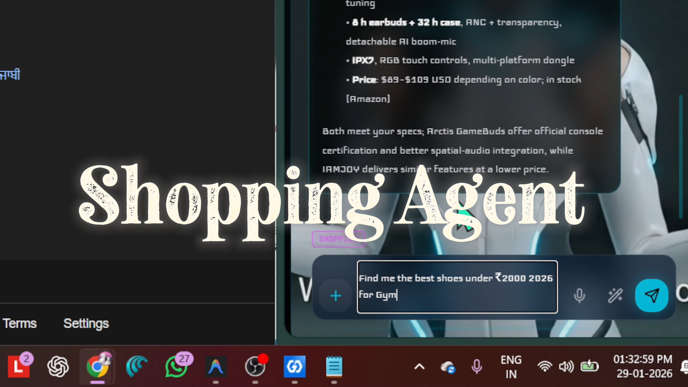
      <br><br>
      
    </td>
  </tr>

  <!-- 3. Voice Agent (NEW) -->
  <tr>
    <td valign="top">
      <h3>🎙️ Voice Agent (NEW)</h3>
      <p>Talk to Nova in <b>any language</b>! Two separate voice modes for maximum flexibility:</p>
      <p><b>🎤 Mic Button</b> (chat input bar) — Simple voice-to-text dictation. Click to start, click again to stop.</p>
      <p><b>🎙️ Voice Agent</b> (top bar, next to model selector) — Full voice assistant overlay with TTS, barge-in, Song Detection, and multilingual conversations.</p>
      <p><b>Supports:</b> Hindi, Telugu, English, Spanish, French, German & more</p>
    </td>
    <td>
      
    </td>
  </tr>

  <!-- 4. Song Detection (NEW) -->
  <tr>
    <td valign="top">
      <h3>🎵 Song Detection (NEW)</h3>
      <p>Identify songs through <b>lyrics</b>! Sing or speak lyrics and Nova will search the web to find the matching song.</p>
      <p><b>How it works:</b></p>
      <ul>
        <li>🎤 Sing lyrics in <b>any language</b></li>
        <li>🔍 Uses web search to identify songs</li>
        <li>📝 Returns song name, artist & details</li>
      </ul>
      <p><i>⚠️ Note: Detects lyrics, not background music/instrumentals. Works great with voice singing!</i></p>
    </td>
    <td>
      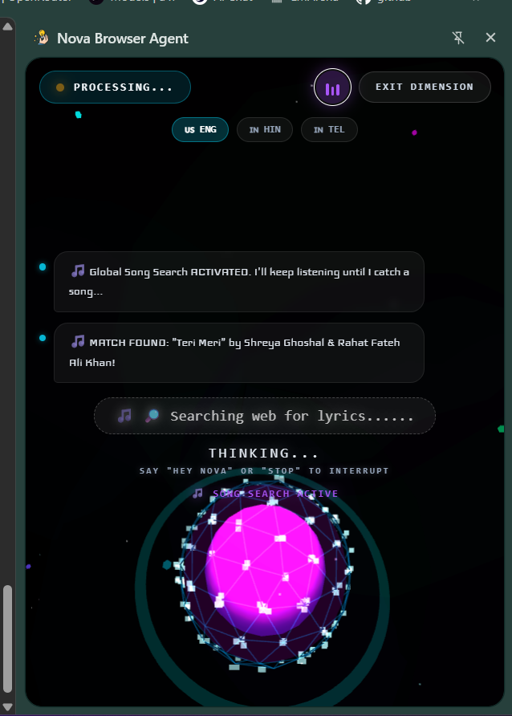
    </td>
  </tr>

  <!-- 5. Files Analyzer -->
  <tr>
    <td valign="top">
      <h3>📂 Files Analyzer</h3>
      <p>Upload & analyze files with Vision AI. Supports <b>images (Vision AI sees them!), PDFs, DOCX, code files, CSV</b> and more.</p>
      <p><i>Nova can actually read text in images, describe photos, and answer visual questions.</i></p>
    </td>
    <td>
      <video src="https://github.com/manojkumarfade/NOVA/raw/main/extension/public/videos/Files%20Analyzer.mp4" controls="controls" width="100%"></video>
      <br><br>
      
    </td>
  </tr>

  <!-- 6. Web Search Agent -->
  <tr>
    <td valign="top">
      <h3>🌐 Web Search Agent</h3>
      <p>An autonomous research powerhouse. Opens <b>6 background tabs</b> simultaneously, reads full page content, and synthesizes fact-based answers with citations. Uses <b>Tavily Search</b> with DuckDuckGo fallback.</p>
    </td>
    <td>
      <video src="https://github.com/manojkumarfade/NOVA/raw/main/extension/public/videos/Web%20Search.mp4" controls="controls" width="100%"></video>
      <br><br>
      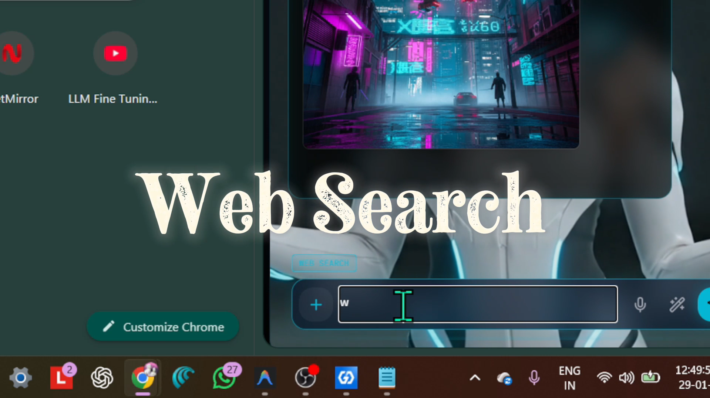 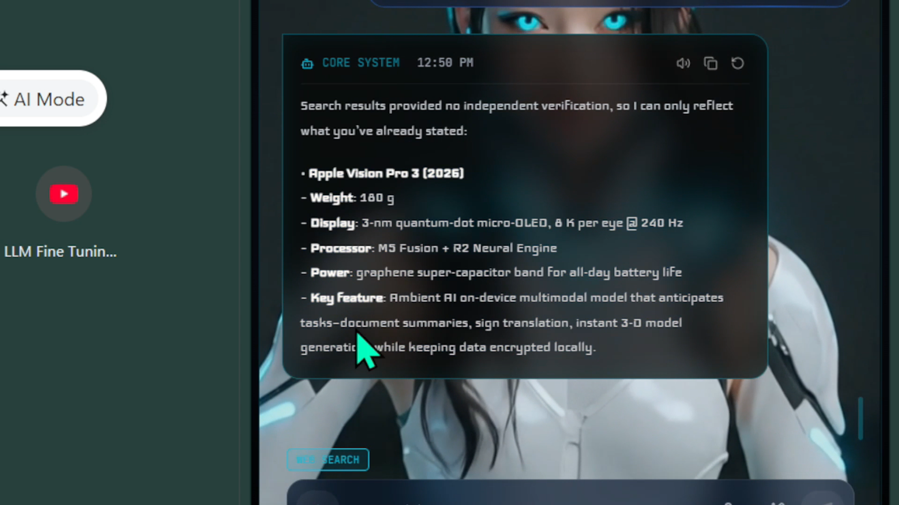
    </td>
  </tr>

  <!-- 7. Image Generation -->
  <tr>
    <td valign="top">
      <h3>🎨 Image Generation + Page Vision</h3>
      <p>Generate images from text prompts. <b>🆕 Page Vision</b>: Say "use this page as reference" and Nova captures a screenshot of the current page to use as visual context for generation!</p>
      <p><i>Perfect for designers using page layouts as inspiration.</i></p>
    </td>
    <td>
      <video src="https://github.com/manojkumarfade/NOVA/raw/main/extension/public/videos/Image%20Generation.mp4" controls="controls" width="100%"></video>
      <br><br>
      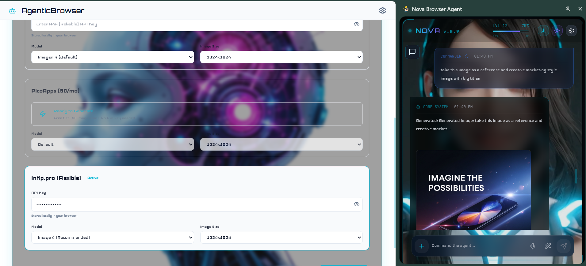 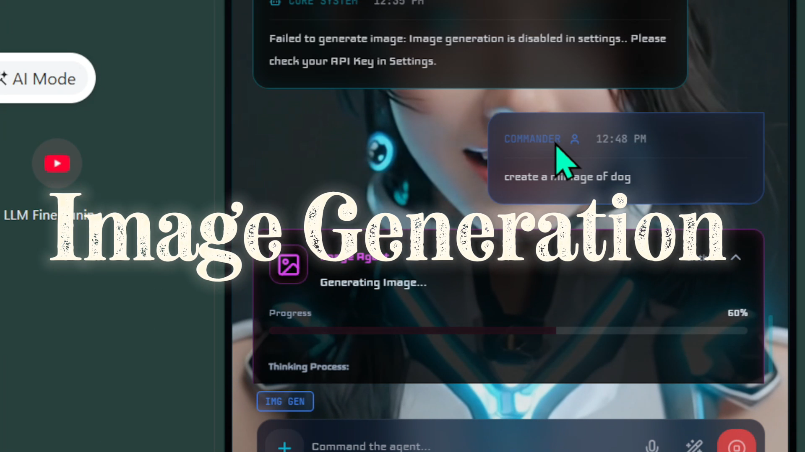
    </td>
  </tr>

  <!-- 8. Side Panel Overview -->
  <tr>
    <td valign="top">
      <h3>💻 Side Panel Overview</h3>
      <p>Your command center, always a click away. The sleek Side Panel interface provides unified access to all agents and tools without cluttering your browsing experience.</p>
    </td>
    <td>
      <video src="https://github.com/manojkumarfade/NOVA/raw/main/extension/public/videos/Side%20Panel%20Overview.mp4" controls="controls" width="100%"></video>
      <br><br>
      
    </td>
  </tr>

  <!-- 9. TTS & Chat -->
  <tr>
    <td valign="top">
      <h3>🗣️ Text-to-Speech (TTS) & Chat</h3>
      <p>Nova speaks responses with advanced Neural TTS. Combined with rich chat history, conversations feel fluid and accessible.</p>
    </td>
    <td>
      <video src="https://github.com/manojkumarfade/NOVA/raw/main/extension/public/videos/TTS.mp4" controls="controls" width="100%"></video>
      <br><br>
      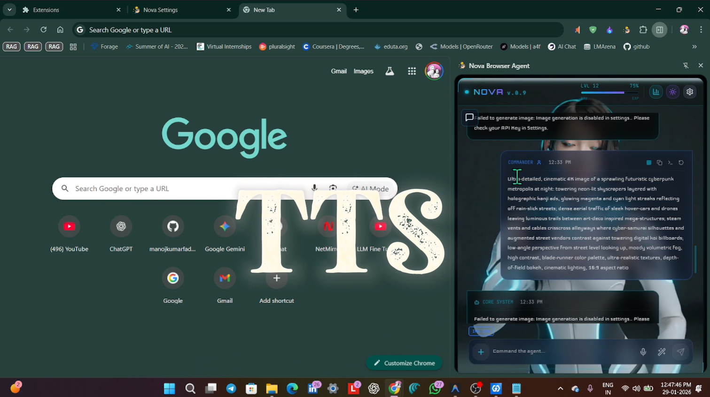 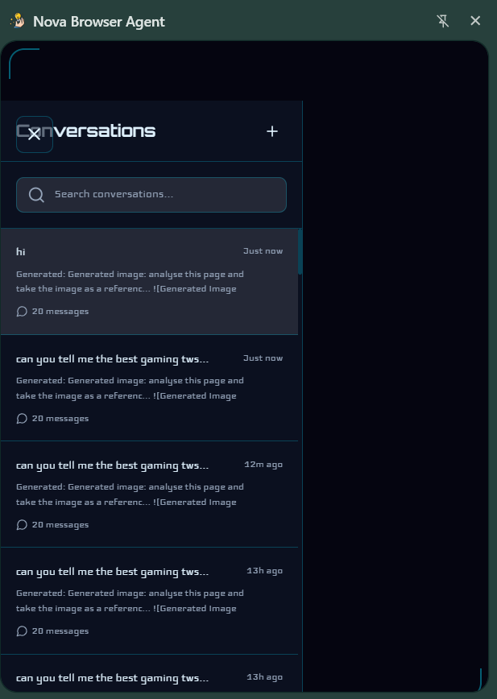
    </td>
  </tr>

  <!-- 10. Security & DOM Vision -->
  <tr>
    <td valign="top">
      <h3>🛡️ Security & DOM Vision</h3>
      <p>See what Nova sees. The <b>Visual Accessibility Tree</b> maps the DOM for precise interaction, while the built-in <b>Security Firewall</b> blocks trackers using <code>declarativeNetRequest</code>.</p>
    </td>
    <td>
      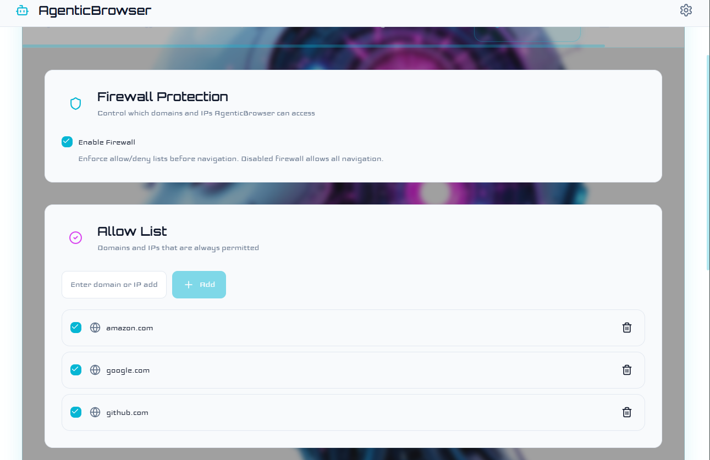 
      <br><br>
       
    </td>
  </tr>

  <!-- 11. Analytics -->
  <tr>
    <td valign="top">
      <h3>📊 Analytics Dashboard</h3>
      <p>Monitor real-time usage metrics, track token consumption, and analyze agent performance with detailed visualizations.</p>
    </td>
    <td>
      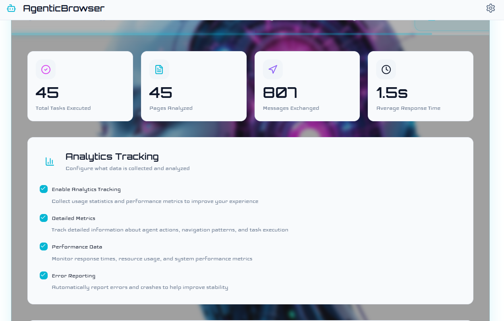 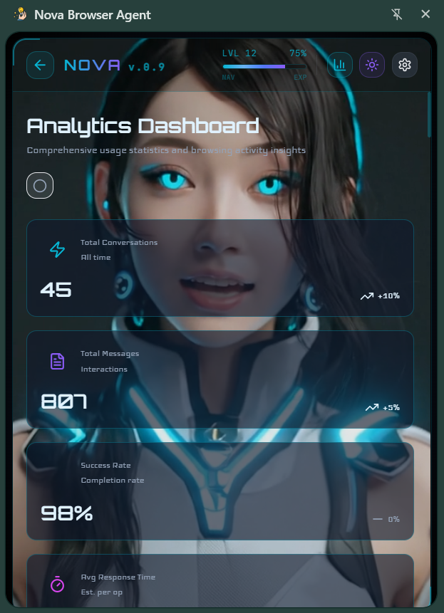
    </td>
  </tr>
</table>

---

## 🔑 Getting Free API Keys

Nova is **100% free & open source**. You just need an API key from any provider:

| Provider | Link | Free? |
| :--- | :--- | :--- |
| **Infip.pro** | [infip.pro](https://infip.pro/) | ✅ Free with generous limits |
| **A4F.co** | [a4f.co/models](https://www.a4f.co/models) | ✅ Free models + image gen |
| **TypeGPT** | [api.typegpt.net](https://api.typegpt.net) | ✅ 20+ free models |
| **Google Gemini** | [aistudio.google.com](https://aistudio.google.com/apikey) | ✅ Free tier |
| **OpenAI** | [platform.openai.com](https://platform.openai.com/api-keys) | 💲 Pay-as-you-go |
| **Anthropic** | [console.anthropic.com](https://console.anthropic.com/settings/keys) | 💲 Pay-as-you-go |
| **xAI (Grok)** | [console.x.ai](https://console.x.ai/) | 💲 Pay-as-you-go |
| **DeepSeek** | [api.deepseek.com](https://api.deepseek.com/) | 💲 Affordable |

---

## 🛠️ Tech Stack

| Category | Technologies |
| :--- | :--- |
| **Core Framework** | React 18, Vite 5, TailwindCSS |
| **Extension Runtime** | Manifest V3 (Service Worker based) |
| **Browser Protocol** | Chrome Debugger Protocol (CDP) |
| **State Management** | Zustand + Supabase (Auth) |
| **AI Models** | 50+ models — GPT-5, Claude 4.6, Gemini 3, Grok 4, DeepSeek R1 |
| **Search** | Tavily + DuckDuckGo fallback |
| **Animation** | Framer Motion |

---

## 🚀 Quick Start Guide

> **📹 Watch the Installation Guide:**
>
> <video src="https://github.com/manojkumarfade/NOVA/raw/main/extension/public/videos/How%20to%20install%20extension.mp4" controls="controls" width="100%"></video>

**1. Clone the repository**
```bash
git clone https://github.com/manojkumarfade/NOVA.git
cd NOVA
```

**2. Install Dependencies**
```bash
npm install
```

**3. Build the Extension**
```bash
npm run build:extension
# Generates production build in extension/dist
```

**4. Load in Chrome**
1. Open `chrome://extensions`
2. Enable **Developer Mode**
3. Click **Load Unpacked** -> Select `extension/dist`

**5. Get API Key**
- Go to [infip.pro](https://infip.pro/) or [a4f.co](https://www.a4f.co/models) for free keys
- Open Nova Settings → LLM Providers → Paste your key

---

## 🧩 Core Logic (Under the Hood)

<details>
<summary><b>🧠 The Cognitive Loop (The Brain)</b></summary>
<br>
Nova operates on a recursive reasoning cycle: <b>Observe -> Think -> Act -> Verify</b>.

```javascript
// AgentService.js (Simplified)
while (!isFinished && turnCount < maxTurns) {
    // 1. OBSERVE: Get visual state of the browser
    const state = await Observer.getBrowserState(tab.id);
    
    // 2. THINK: Predict next action using LLM
    const prompt = `Goal: ${userRequest} \n State: ${state}`;
    const action = await LLMClient.chatCompletion(prompt);
    
    // 3. ACT: Execute action via CDP
    await hybridCore.executeAction(action, state.interactives);
    
    // 4. VERIFY: Check if the action had the desired effect
    const newState = await Observer.getBrowserState(tab.id);
    if (newState.url === state.url) {
        history.push("System: Action seemed to fail. Retrying...");
    }
}
```
</details>

<details>
<summary><b>👁️ DOM Analysis (The Eyes)</b></summary>
<br>
Nova scans the DOM and assigns unique IDs to interactive elements to create a Visual Accessibility Tree.

```javascript
// Observer.js
function getBrowserState() {
    const interactives = document.querySelectorAll('button, a, input');
    return Array.from(interactives).map((el, index) => ({
        id: index + 1,
        tag: el.tagName,
        rect: el.getBoundingClientRect()
    }));
}
```
</details>

<details>
<summary><b>🤖 Hybrid Execution (The Hands)</b></summary>
<br>
Handles modern apps by falling back to CDP hardware simulation when JS clicks fail.

```javascript
// Navigator.js
async executeStep(action) {
    if (action.action === "CLICK") {
        const jsSuccess = await this.tryJSClick(action.id);
        if (!jsSuccess) {
            // Hardware Mouse Simulation
             await chrome.debugger.sendCommand({ tabId }, "Input.dispatchMouseEvent", { 
                type: "mousePressed", x, y, button: "left" 
            });
        }
    }
}
```
</details>

---

## 📬 Contact & Support

For support, feedback, or collaboration:

| Platform | Link |
| :--- | :--- |
| **LinkedIn** | [](https://www.linkedin.com/in/booramanojkumar/) |
| **Telegram** | [](https://t.me/nova_gent) |

---

Created with ❤️ by **Manoj Kumar** © 2026. All Rights Reserved.
